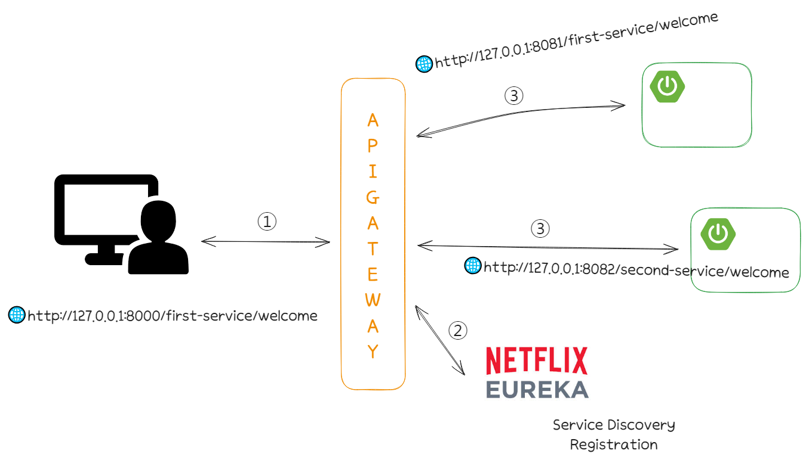

# msa_study

> Spring Boot 기반 MSA 공부

## ⚙ Environment

```
- Spring Boot 3.2.4
- Eureka Server
- Eureka Client
- Spring Cloud Starter Gateway 4.1.1

```

## 📌 Purpose

Spring Boot로 MSA 환경 체험용
<br>
비즈니스 로직이 없는 환경 설정만 구현

## ✨ Function

- Eureka
- Gateway Filter
- Gateway Load Balancer

## 📐 Architecture


